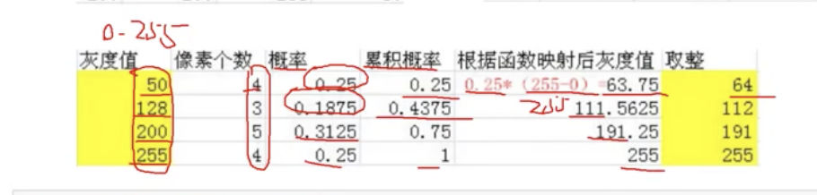

图像直方图

```
cv2.calcHist(images,channels,mask,histSize,ranges)

# channels -->[0]或者[0][1][2]
# histSize --> 直方图有多少个条
# range 一般是 [0,256]

img = cv2.imread("cat.jpg",0) #0 表示灰度图
hist = cv2.calcHist([img],[0],None,[256],[0,256])

hist.shape # (256,1)

plt.hist(img,ravel(),256)

# 彩色图

img = cv2.imread("cat.jpg")

color = ("b","g","r")

for i,col in enumerate(color): #i 是 0,1,2 col 是 bgr
	histr =cv2.calcHist([img],[i],None,[256],[0,256])
	plt.plot(histr,color = col)
	plt.xlim([0,256])
```


直方图均衡化

有些位置特别高，有些位置几乎没有

把尖尖的变成矮胖的

```python
equ = cv2.quelizeHist(img)

#下面是展示直方图的代码
plt.hist(equ.ravel(),256)
plt.show
```

均衡化有可能会损失细节

自适应均衡化，对图像分割成小格子做均衡化

```python

```

傅立叶变换

滤波器

低通滤波器 --> 只保留低频 --> 变模糊

高通滤波器 --> 只保留高频 --> 变清晰 --> 锐化

高频 --> 变化剧烈的灰度分量

低频 --> 变化缓慢的灰度分量

