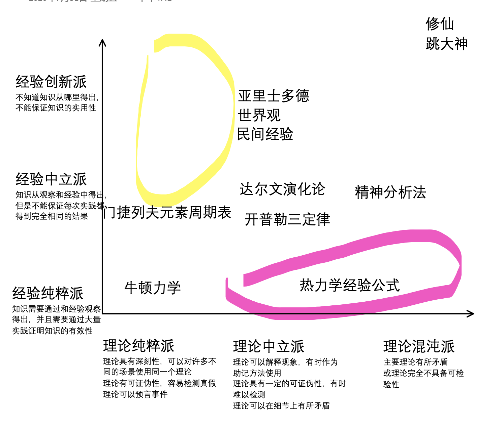

# 读书笔记：科学哲学 Part 1

## 0x00 科学的定义 

### 看法1:

 科学是用来理解、解释和预言世界的。

反驳：

各种宗教也试图理解、解释和预言世界，但是通常宗教不被看作是科学。

### 看法2

科学的特征是使用科学的方法探索世界。

例子，实验法。但是不是所有科学都使用实验法，比如天文学就只能观察之后提出假说。

## 0x01 什么是伪科学

### 看法1

卡尔波普：科学理论具有可证伪性

弗洛伊德的观点几乎可以解释一切事物，这对理解世界没有帮助。

“全能的神”解释方式。为什么天会下雨，因为全能的神让天下雨。为什么现在不下了，因为全能的神不让它下了。

可以符合任何观察的理论值得怀疑。

反驳：

天王星轨道的例子。观测到的天王星轨道和预测有偏差，但是科学家不认为牛顿的理论是错误的。他们继续观察，发现了海王星。

导致一个理论和现实有偏差的原因很多，很多时候分不清楚是理论错误还是观测中的误差。

结论：

可证伪性并不能完全区分科学和非科学。可否作出预测也是重要的评价指标。但是仅凭这两点还是不够。

## 0x02 科学和真实

总有观点说科学的就是真的，然而并不是。在用形容词“科学的”之前要小心。人们总是把“科学的”和“正确的”混淆。

比如“科学的治疗方法”并不能保证治好病，只能保证现代医学可以解释这种方法或者统计学上有效。实际应用上，“科学的治疗方法”不保证比“非科学的方法”有效。

## 0x03 科学的历史

哥白尼日心说 -> 开普勒三定律 (观察，亚里士多德世界观) -> 伽利略实验法（数学描述物理） -> 笛卡尔机械论 -> 牛顿 (精确定量) -> 量子力学和相对论

达尔文 （归因逻辑 ） -> DNA & 新心理学

## 0x04 观点

可能科学这样一种多元化活动是没有一个准确定义的，他需要在使用和语境中凸显期意义。

> 哲学家路德维希·维特根斯坦就认为，不存在能够定义何为“游戏”的一系列固定的特征；但却存在一束松散的特征，这些特征的大部分被大多数的游戏所拥有。然而也许某个特定的游戏不具有该特征束中的任一特征，却仍然是一个游戏。科学或许也是如此。如果真是这样，将科学与伪科学区分开来的一个简单化标准就不可能找到。

~~我还是不太喜欢这样一个看法。我觉得还是应该给科学下一个准确的定义，不然在讨论使用科学能讨论的范畴的时候会出问题。在讨论科学的时候，我们应该先明确一套话语体系，不然会出现数学是不是科学或者科学是不是对的这样的问题。~~

现在我觉得科学和非科学之间不应该有一个硬分界，一个理论或者学科的科学性也不是单一一个指标就能衡量的。我现在想到一种科学分类的方法可以用经验性和理论性两个角度来衡量一个学科或者理论的科学程度。选择两个角度的原因是这样比较容易画出来，如果想更细致的话，也可以用更多指标来画。

图中粉色圈圈的黄色圈圈的地方不是说没有理论处于这个区间，实际上我认为大多数前沿科学都在黄圈和粉圈里。但是第一我不太了解这个领域所以也不敢往上放东西，第二前沿的东西不太适合和图上的这些东西摆到一起，不然坐标轴的尺度会比较混乱。我猜想黄圈一些理论物理的内容，比如说通过数学上的对称提出的各种理论或者预言的各种粒子。猜想粉圈里有一些材料科学和医药学的内容，比如各种金属的处理方法或者复杂药物作用。

## EOF