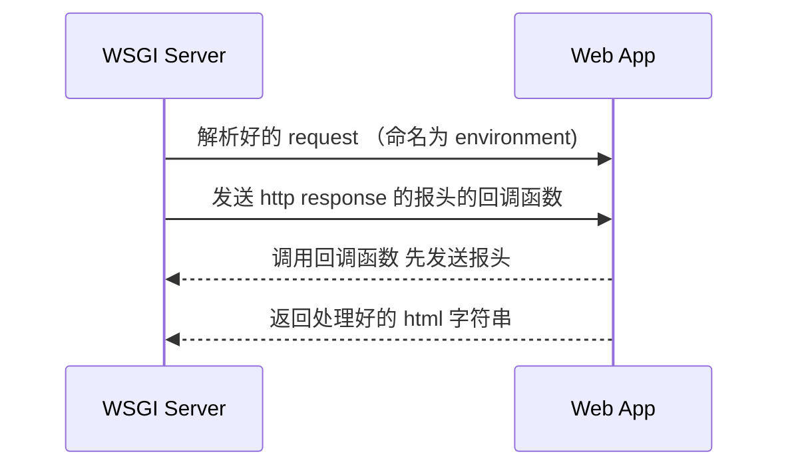

# Python WSGI服务器

预备知识：socket、 browser server 架构

## 什么是 web 服务器

web 服务器是一个机器：接受一个字符串作为输入（HTTP request），之后将一个字符串作为输出（HTTP response）。其中输入和输出的字符串都要符合一定的标准（HTTP）。

## WSGI 服务器

事实上，我们构建 web app 并不需要自己解析 request 字符串。WSGI 服务器可以帮助我们专注于业务逻辑。它会帮我们解析好 request，我们只需要根据解析好的信息生成一个字符串和一个返回码还给 wsgi 服务器，他会自动帮我们包装成 html 文件和 response 报文。



我们只需要读 WSGI 生成的 environ 字典，根据这个字典生成一个 html 字符串并返回就好了。WSGI 服务器会自动帮我们处理协议和通讯上的事情。但是要记住的是，我们一定要调用 WSGI 给我们的回调函数，这样可以通知浏览器我们返回了一个 html 页面，让他准备解析。

下面会分成 Web App 和 Web Server 两方面来介绍。


## Web App

```python
from wsgiref.util import setup_testing_defaults
from wsgiref.simple_server import make_server

def simple_app(environ, start_response):
    status = "200 OK"
    headers = [("Content-type","text/plain;charset=utf-8")]
    start_response(status,headers)#调用回调函数，告诉浏览器怎么解析
    ret = ["Hello world".encode("utf-8")]
    return ret #要求是返回一个可迭代对象，内部是 string

httpd = make_server("0.0.0.0",9000,simple_app)
#格式是 ip，端口，主程序

try:
    httpd.serve_forever()
except Exception as e:
    print(e) #如果出错了，服务器不能停
except KeyboardInterrupt:
    print("stop")
    http.server_close()
```

这个程序会在 `localhost:9000` 上开启一个 http 服务，不管我们的url是什么，它都会返回一个 `hello world` html 页面。


## WSGI Server 的接口

WSGI 至少要提供两个接口

```python
make_server(ip_address : str, port : int, web_app : Callable) -> server
# 生成一个 server 对象

server.serve_forever()
# 运行 server
```

首先，`make_server` 接收了 `ip_address` 和 `port` 两个参数，而 web app 不需要处理 socket 链接，所以 WSGI server 要处理好 socket 链接。


第二，web app 的函数签名是`(Environ, StartResponse) -> Iterable[str]`

其中 `Environ ` 是一个字典，储存的是报头信息（这部分需要看我另一篇笔记），所以 WSGI server 需要把 报头 转化成 一个字典。

而 `StartResponse` 是一个回调函数，函数接受

这里的返回值我不是很确定，不过我觉得这个函数只是把信息更新到存储到 Server 里，方便真正发出 http response 的时候读取。


第三，`serve_forever` 说明了 WSGI 还包括了循环处理请求（可能是阻塞的、并行的或者是异步的）和错误处理。


## WSGI Server 的实现

分析过 WSGI Server 的接口，我们反推一下它是怎么实现的

```python
class WSGIServer():
  def __init__(self, server_address, server_port, app):
    address_family = socket.AF_INET
    socke_type = socket.SOCK_STREAM
    request_queue_size = 10

    self.listen_socket = socket.socket(address_family, socket_type)
    self.listen_socket.bind(server_address, server_port)
    self.listen_socket.listen(request_queue_size)
    self.app = app
```

绑定 socket 和 app


```python
class WSGIServer():
  def __init__():
     pass
  
  def handle_one_request(self, connection):
    request_data = connection.recv(1024)
    environ = self.get_environ(request_data)
    result = self.app(environ, self.start_response)
    self.send_response(result, connection)
```

先写怎么处理单个请求

其实就是两件事，`get_environ`在执行 web app 逻辑之前封装 envrion， `send_response`在执行之后发送 http 报文。


```python
class WSGIServer():
	def __init__(): pass
  def handle_one_request(): pass
  
  def get_environ(self, request_data):
    # 解析 http 请求，获取 request method cookie query string route 等
    # 具体的逻辑就略过了
    pass
  
  def send_response(self, result, connection):
    try:
      response = f"HTTP/1.1 {self.status}"
      for header in self.response_headers:
        response += "{header[0]} : {header[1]}"
      response += "\r\n"
      for line in result:
        response += line
      connection.sendall(response)
    finally:
      connection.close()
```

`send response` 

那么单个请求大概就是这样处理的


```python
class WSGIServer():
  # ...
  
  def serve_forever(self):
    while True:
      connection, address = self.listen_socket.accept()
      self.handle_one_request(connection)
```

`serve_forever` 实际上就是循环 `handle_one_request`


```python
class WSGIServer():
  # ...
  
  def start_response(self, status, response_headers):
    self.status = status
    self.reponse_headers = [] + reponse_headers
```

这里 `start_response` 的实现只是把 `status` 和 `response_header` 记录下来，为了之后 `send_response` 的时候调用。


## 进一步简化 WebApp

WSGI 服务器 已经帮我们做了解析 http request 和 链接 socket 的工作，但是还有一些重复性工作没有解决。比如处理路由、Cookie、套用 http 模版等等。那么我们可以用一些其他的库解决这些问题。

下面介绍一个进一步姐写 environ 的库。

## Webob

webob 是一个帮我们解析 environ 的库

那么我们先看看 environ 都包括什么

输入会包括以下内容：

- HTTP 方法 （POST，GET，DELETE 等）
- URL （+ query string）
- Cookie
- Request Header 里的信息

### URL

如果我们希望访问一个静态网页，那么单用url就够了。我们告诉服务器，我们想要一个 html 页面，这个页面就存在这个目录，那么你给我这个文件用字符串的形式就好了。

- 全称 uniform resource locator
- `schema://host[:port#]/path/.../[;url-params][?query-string][#anchor]`
- 理解为访问静态资源，某路径下的某个html文件
- `?key=value1&key=value2` 浏览器向服务器发的数据

### Restful API

如果我们希望访问一个静态网页，那么单用url就够了。我们只需要告诉服务器展示哪个 html 页面。但是，如果我们希望访问一个动态网页，服务器动态生成 html 页面的话。那么我们就需要使用 HTTP 方法，URL，Query String，Request Header 一系列信息。

我们其实可以把一个 Restful 的请求 看作一个对数据库的 增删改查 。

HTTP 方法就是指明是 增改删查 的哪种。

URL 是指向资源的虚拟地址

Query String 和 Request Header 表示 增改删查 的操作对象和参数。