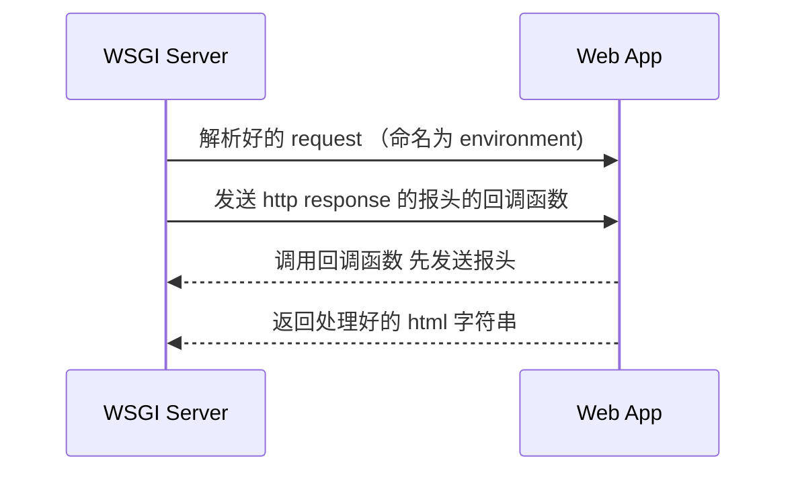

# Python web服务器

## 什么是 web 服务器

我的理解是 web 服务器就是一个函数，这个函数接受一个字符串作为输入（HTTP request），之后将一个字符串作为输出（HTTP response）。其中输入和输出的字符串都要符合一定的标准（HTTP）。

## WSGI 服务器

事实上，我们构建 web app 并不需要自己解析 request 字符串。WSGI 服务器可以帮助我们专注于业务逻辑。它会帮我们解析好 request，我们只需要根据解析好的信息生成一个字符串和一个返回码还给 wsgi 服务器，他会自动帮我们包装成 html 文件和 response 报文。所以我们可以理解一个 web app 就是接受



这里解释的不是很清楚，不过我们只要知道我们现在需要做的就是 Web App 的 部分。

我们只需要读 WSGI 生成的 environ 字典，根据这个字典生成一个 html 字符串并返回就好了。WSGI 服务器会自动帮我们处理协议和通讯上的事情。但是要记住的是，我们一定要调用 WSGI 给我们的回调函数，这样可以通知浏览器我们返回了一个 html 页面，让他准备解析。

直接看个例子比较容易理解

## 最简 Web App

```python
from wsgiref.util import setup_testing_defaults
from wsgiref.simple_server import make_server

def simple_app(environ, start_response):
    status = "200 OK"
    headers = [("Content-type","text/plain;charset=utf-8")]
    start_response(status,headers)#调用回调函数，告诉浏览器怎么解析
    ret = ["Hello world".encode("utf-8")]
    return ret #要求是返回一个可迭代对象，内部是

httpd = make_server("0.0.0.0",9000,simple_app)
#格式是 ip，端口，主程序

try:
    httpd.serve_forever()
except Exception as e:
    print(e) #如果出错了，服务器不能停
except KeyboardInterrupt:
    print("stop")
    http.server_close()
```

这个程序会在 `localhost:9000` 上开启一个 http 服务，不管我们的url是什么，它都会返回一个 `hello world` html 页面。

接下来我们写一个程序，根据 浏览器发给我们的 url 返回不同的信息。

## Webob

webob 是一个帮我们解析 environ 的库，相较 http request ，environ 已经很简单了。但是对于我们的业务来说，我们希望更简单的调用方法

接下来就简单介绍下各个东西都是啥

## 分析输入

如果我们想设计一个函数满足需求，我们先要分析分析这个函数的输入是怎么样的。

输入会包括以下内容：

- HTTP 方法 （POST，GET，DELETE 等）
- URL （+ query string）
- Cookie
- Request Header 里的信息

##

### URL

如果我们希望访问一个静态网页，那么单用url就够了。我们告诉服务器，我们想要一个 html 页面，这个页面就存在这个目录，那么你给我这个文件用字符串的形式就好了。

- 全称 uniform resource locator
- `schema://host[:port#]/path/.../[;url-params][?query-string][#anchor]`
- 理解为访问静态资源，某路径下的某个html文件
- `?key=value1&key=value2` 浏览器向服务器发的数据

### Restful API

如果我们希望访问一个静态网页，那么单用url就够了。我们只需要告诉服务器展示哪个 html 页面。但是，如果我们希望访问一个动态网页，服务器动态生成 html 页面的话。那么我们就需要使用 HTTP 方法，URL，Query String，Request Header 一系列信息。

我们其实可以把一个 Restful 的请求 看作一个对数据库的 增删改查 。

HTTP 方法就是指明是 增改删查 的哪种。

URL 是指向资源的虚拟地址

Query String 和 Request Header 表示 增改删查 的操作对象和参数。